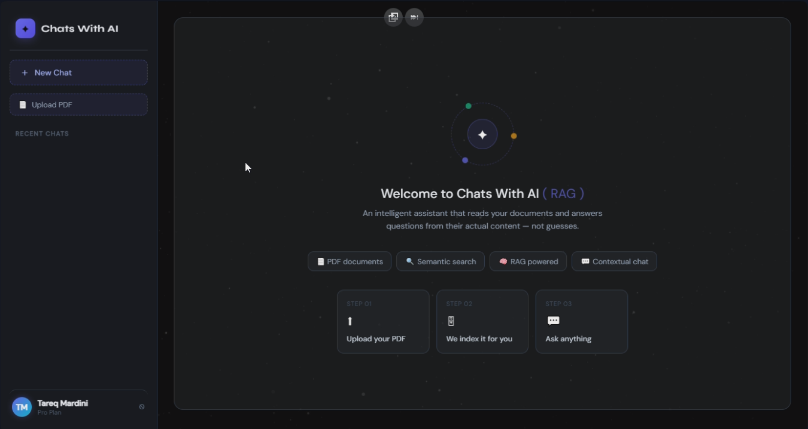
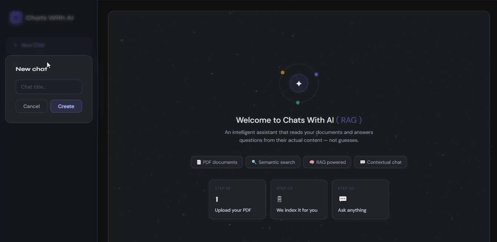
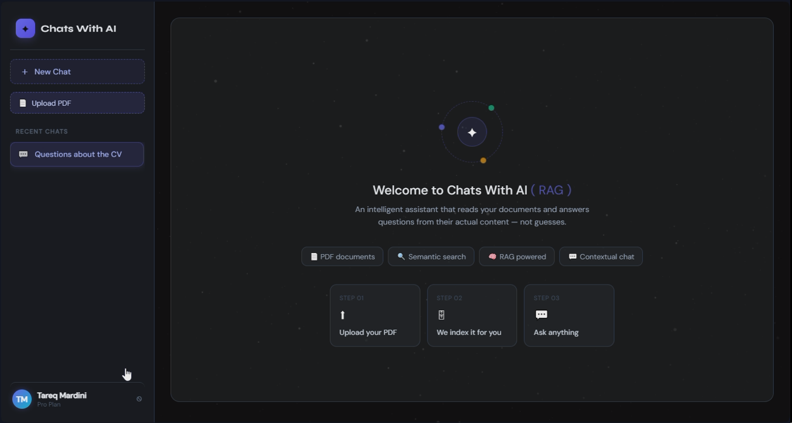
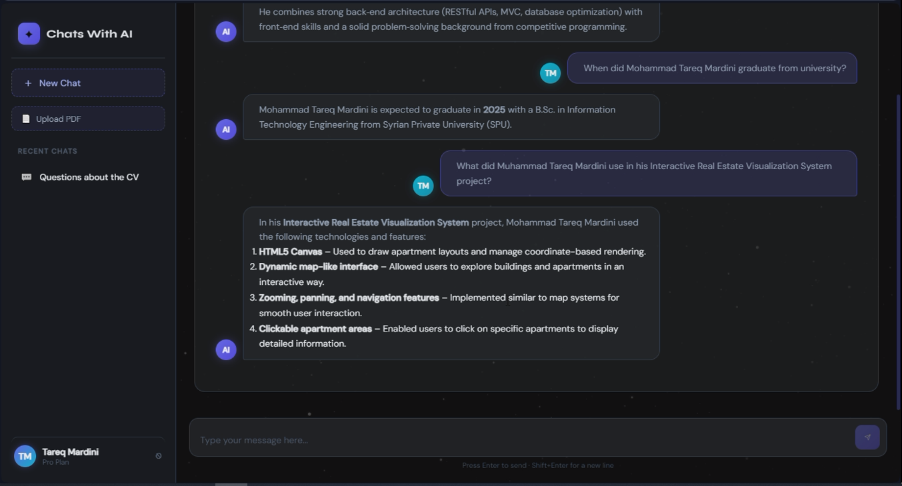

# 🚀 RAG PDF Chat System

An AI-powered Retrieval-Augmented Generation (RAG) platform built using React, Laravel, HuggingFace Embeddings, Qdrant Vector Database, and OpenRouter LLMs.

The system enables users to upload PDF documents, perform semantic search, and interact with AI-powered contextual chat using modern RAG architecture.

---

# 🖼️ System Screenshots

---

## 🏠 Main Dashboard

The main application interface where users can manage chats and uploaded documents.



---

## 💬 Create New Chat

Users can create new AI conversations and manage multiple chat sessions.



---

## 📄 Upload PDF Documents

Upload and process PDF documents for semantic retrieval and AI-powered interaction.



---

## 🤖 AI Chat Interface

Interactive contextual chat powered by RAG architecture and vector similarity search.



---

# 🌟 Features

✅ PDF Upload & Processing  
✅ Semantic Vector Search  
✅ AI-Powered Question Answering  
✅ Full RAG Pipeline Implementation  
✅ Context-Aware Responses  
✅ Persistent Chat History  
✅ User Authentication System  
✅ Multi-User Conversation Management  
✅ Vector Similarity Search with Qdrant  
✅ Chunk-Based Retrieval  
✅ React + Laravel Full Stack Architecture  
✅ Modern Responsive UI

---

# 🧠 System Architecture

```text
PDF Upload → Text Extraction → Chunking → Embeddings → Qdrant Vector Store
                                                        ↓
User Question → Query Embedding → Vector Search → Context Retrieval → LLM Response
```

---

# ⚡ Tech Stack

## Frontend

- React
- Vite

## Backend

- Laravel

## AI / RAG Stack

- HuggingFace Embeddings API
- OpenRouter LLM API
- Qdrant Vector Database

## Database

- MySQL

---

# 🔐 Authentication & Chat System

The platform includes a complete authentication and conversation management system.

### Features

- User registration & login
- Secure authentication system
- Persistent chat history storage
- Multi-session conversation support
- User-specific conversations and documents
- Stored AI interactions and messages

---

# 📦 Project Setup

---

# 1️⃣ Clone Repository

```bash
git clone <your-repository-url>
cd <project-folder>
```

---

# 🔥 Backend Setup (Laravel)

## 2️⃣ Navigate to Backend

```bash
cd Backend
```

---

## 3️⃣ Install PHP Dependencies

```bash
composer install
```

---

## 4️⃣ Create Environment File

```bash
cp .env.example .env
```

---

## 5️⃣ Generate Laravel Application Key

```bash
php artisan key:generate
```

---

# ⚙️ Configure Environment Variables

Open `.env` file and configure:

```env
APP_NAME=RAG_SYSTEM
APP_ENV=local
APP_KEY=
APP_DEBUG=true
APP_URL=http://localhost:8000

DB_CONNECTION=mysql
DB_HOST=127.0.0.1
DB_PORT=3306
DB_DATABASE=rag_system
DB_USERNAME=root
DB_PASSWORD=

HUGGINGFACE_API_KEY=your_huggingface_api_key

OPENROUTER_API_KEY=your_openrouter_api_key

QDRANT_HOST=http://localhost:6333
```

---

# 🔑 Required API Keys

## 🤗 HuggingFace API

https://huggingface.co/settings/tokens

### Embedding Model

```text
BAAI/bge-small-en-v1.5
```

### Vector Dimension

```text
384
```

---

## 🧠 OpenRouter API

https://openrouter.ai/keys

---

# 🗄️ Database Setup

## 6️⃣ Create MySQL Database

```sql
CREATE DATABASE rag_system;
```

---

## 7️⃣ Run Database Migrations

```bash
php artisan migrate
```

---

# 📁 Storage Setup

## 8️⃣ Create Storage Link

```bash
php artisan storage:link
```

---

# 🚀 Run Laravel Backend

## 9️⃣ Start Laravel Server

```bash
php artisan serve
```

---

# 🧩 Qdrant Vector Database Setup

## 🔟 Run Qdrant using Docker

```bash
docker run -p 6333:6333 qdrant/qdrant
```

---

## 1️⃣1️⃣ Create Qdrant Collection

```bash
curl -X PUT "http://localhost:6333/collections/chunks" ^
-H "Content-Type: application/json" ^
-d "{\"vectors\":{\"size\":384,\"distance\":\"Cosine\"}}"
```

---

# 💻 Frontend Setup (React + Vite)

## 1️⃣2️⃣ Navigate to Frontend

```bash
cd ../Frontend
```

---

## 1️⃣3️⃣ Install Dependencies

```bash
npm install
```

---

## 1️⃣4️⃣ Configure Frontend Environment

```env
VITE_API_URL=http://localhost:8000/api
```

---

## 1️⃣5️⃣ Run Frontend

```bash
npm run dev
```

---

# 👨‍💻 Author

Built by Mohammad Tareq Mardini using Laravel, React, Qdrant, and modern AI tooling.
